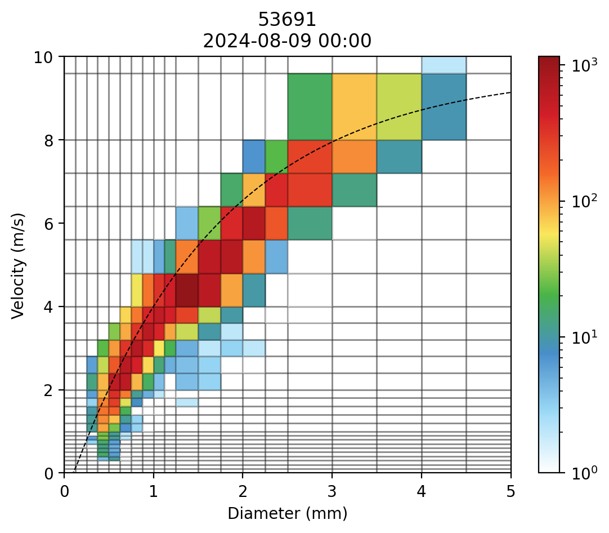

# cnrsd

解析中国 BUFR 格式的雨滴谱文件

## 安装

```bash
pip install cnrsd

# 额外含有 pandas 和 xarray 依赖
pip install cnrsd[all]
```

## 基本用法

```python
import cnrsd

# 读取 BUFR 文件
filepath = "sample/Z_SURF_I_53691_20240809000000_O_AWS-RSD-MM_FTM.BIN"
rsd = cnrsd.RSD.from_file(filepath)

# 转换成方便处理的类型
df = rsd.to_dataframe()
da = rsd.to_dataarray()

# 批量转换类型
df = cnrsd.rsds_to_dataframe(rsds)
```

示例：[examples/plot_station.py](examples/plot_station.py)



## TODO

- [ ] 样例文件
- [ ] 详细的 README
- [ ] 单元测试、CI
- [ ] 雨强、液态水含量
